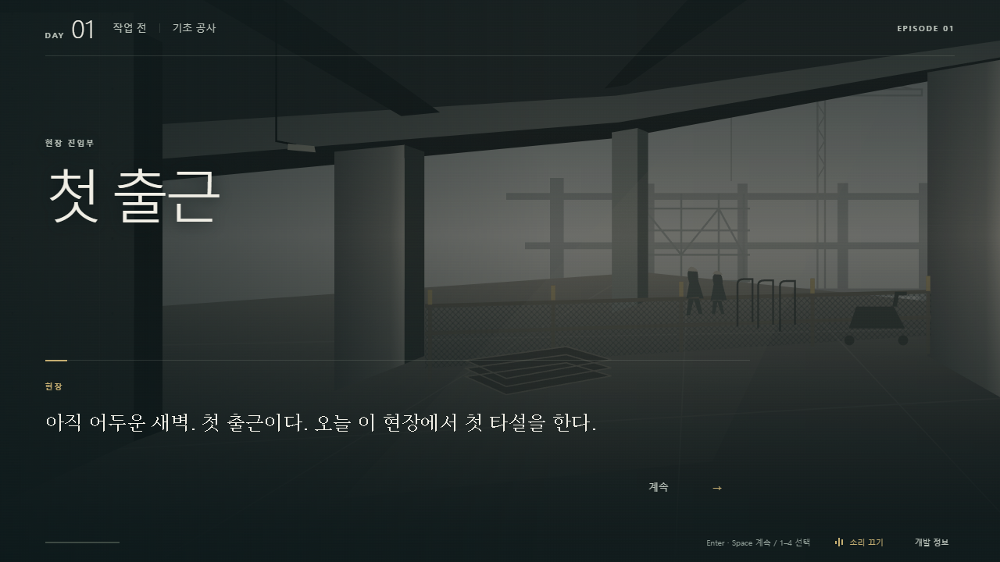

# TASK-006A — Intro Immersion Refinement

기존 `astra/task-006a-visual-quality` 구현을 이어서 보강했다. 브랜치를 새로 만들거나 기존 비주얼을 초기화하지 않았다.

## 오프닝과 장면 연결

타이틀의 산업 현장 구도를 유지하고, 첫 출근을 새벽 조명·큰 제목·넓은 내레이션으로 연결했다. 추가 클릭이나 강제 지연 없이 기존 arrival → 강태식 첫 대면 → 대화 → 첫 판단 순서를 따른다. 장소와 현재 문제가 같은 상단 영역에 나타나므로 대화와 판단 화면의 맥락을 유지한다. 일반 narration의 큰 보고서 번호는 제거하고 현장 내 주인공 관점으로 연결했다.

`content/episode01/immersion.json`은 이벤트별 장소/긴장 문구, 표시 노드별 shot, 인물별 공종/담당 기능을 담는 **표시용 데이터**다. `scene-context.ts`가 현재 event/text ID로 조회한다. 자격 조건·참가자·효과·게임 시간·관계값은 판정하거나 수정하지 않는다. GameState와 독립된 진행 저장소도 만들지 않았다.

## 인물 소개와 주인공

첫 대면 장면은 이름, 기존 역할, 공종, 현장에서 맡은 기능을 큰 이름과 작은 설명으로 보여준다. 이후 장면은 이름 크기와 설명을 줄인다. 소개 강조는 저작된 text_id로 정해지며 저장 파일의 별도 ‘만남 해금’이 아니다. 분기를 건너뛰어 나중에 등장한 NPC도 역할·공종·기능을 읽을 수 있다.

정상 게임 화면의 주인공 이름은 `ui.protagonist`의 **신임 안전관리자**다. canonical character ID와 이름 데이터, Session의 character 조회는 변경하지 않았다. Debug에서 기존 내부 이름을 볼 수 있다.

기존 실루엣에 손·손목, 시선·턱선, 옷 주름과 장비를 보강했다. 강태식은 팔을 모은 넓은 자세, 윤성호는 동선을 가리키는 팔, 이재훈은 클립보드를 잡는 손, 임준호는 앞에 모은 손으로 구분한다. 실제 portrait URI 교체와 로딩 실패 시 fallback은 그대로다.

## 문구와 글자 위계

승인된 네 첫 선택과 임준호의 두 응답은 검토 후 그대로 유지했다. 이미 위임·협의·일정 조정·경청/작업 우선의 차이를 표현하고 있기 때문이다. 선택 ID·text_id·효과도 바꾸지 않았다.

표시 질문 네 개를 보강했다.

- 계획: ‘막힌 동선, 겹친 작업. 어디부터 개입할까?’
- 임준호: ‘멈춘 말의 끝을 들을까, 작업을 먼저 볼까?’
- 경사로: ‘진입 준비에 앞서, 경사로를 어떻게 확인할까?’
- 통로: ‘펌프카가 들어올 통로, 어떻게 정리할까?’

localization의 ‘현장 판단’, ‘현장의 목소리’, ‘첫 대면’과 현장 위치/기능 문구를 사용한다. 코드에 최종 한국어 문장을 넣지 않았다. 소개 이름/판단 prompt/context 전용 크기 토큰을 추가했고, 대화는 로컬 serif 계열, 판단은 굵은 sans 계열로 구분했다. 외부 폰트나 새 의존성은 없다.

## 배경과 반응형

공유 IndustrialScene에 형틀 자재 묶음, 철근 운반 차량, 공정 조정 보드, 경사로 방향 통로를 표시용 focus별로 겹친다. 위치를 매 대사마다 새로 만들지 않는다. PRE_WORK는 어두운 새벽, EVENING은 낮은 밝기와 제한적인 따뜻한 색조로 바뀐다. 실제 규칙은 여전히 day/slot을 사용한다.

1280×720·1920×1080에서 인물 소개와 오른쪽 전경 대화를 유지했다. 854×393에서는 상황 설명을 인물 머리 위와 겹치지 않게 오른쪽 상단으로 옮겼다. 선택은 기존 48px 이상 높이, 3개 이상일 때 두 열을 유지한다. reduced-motion에서는 소개/배경 등장과 transition을 제거한다. 관계 피드백과 Debug 경계는 유지했다.

## 오디오: 초기 합성 패스 구현

`SiteAudio`는 presentation 전용 Web Audio 레이어다. 기본은 음소거이며 **‘소리 켜기’ 클릭 전에는 AudioContext 자체를 만들지 않는다.** 사용자가 켜면 다음을 제공한다.

- 현장 앰비언스: 고정 seed로 합성한 필터링된 공기음과 낮은 기계음.
- 타이틀: 억제된 세 음의 지속음. 실제 플레이 진입 시 fade out.
- 조작: 계속/선택 focus·hover/확정의 짧은 톤. hover는 연속 재생을 제한한다.
- 관계 변화: 대상과 증감을 판단하지 않는 작은 중립적 알림음.

master gain은 낮은 고정값이며, 음소거와 탭 숨김 시 0으로 fade한다. 화면 해제 시 AudioContext를 닫는다. 브라우저 재생 거부/미지원은 비활성 안내로 처리하고 게임 입력은 계속 가능하다. 오디오 재생 여부는 저장되는 GameState에 추가하지 않았으며 기존 AudioState나 AUDIO_CUE 실행 규칙도 변경하지 않았다. 세션/엔진의 RNG를 소비하지 않는다.

이 소리는 직접 만든 합성 스케치이며 실제 현장 녹음이나 최종 BGM이 아니다. 녹음 자산, 작곡, 기기별 최종 믹싱, 볼륨 슬라이더·설정 저장은 후속 범위다. 이번 패스는 켜기/끄기와 낮은 고정 gain을 제공한다.

## 파일과 테스트

- 표시 데이터: `content/episode01/immersion.json`, `ko.json`, `content/localization/playable-ko.json`.
- UI: `scene-context.ts`, `PlayableEpisode.tsx`, `VisualSlot.tsx`, `PresentationView.tsx`, `IndustrialScene.tsx`, `WorkerSilhouette.tsx`, `playable.css`.
- 오디오: `src/presentation/site-audio.ts`, `src/ui/use-scene-audio.ts`.
- 테스트: `tests/intro-immersion.test.tsx` 신규 8개. 표시 참조/localization, 소개·주인공 호칭, 장면 단서·선택 유지, 기본 음소거와 사용자 활성화, 재생 실패, 정상 입력 cue, 탭 숨김·해제 정리를 검증한다.
- 문서: 본 문서, TASK-006A의 후속 문서 링크, README 및 `docs/visual/task-006a-refine/`의 브라우저 캡처.

최종 `npm test`: **259개 PASS / 14개 파일**. 기존 251개 테스트를 수정·삭제하지 않았다. `npm run typecheck`: PASS. `npm run build`: PASS.

실제 브라우저에서 세 목표 해상도, 첫 출근/첫 인물 소개/첫 판단/임준호 응답, 키보드 focus, 오디오 토글과 Debug를 확인했다. 854×393의 네 선택은 모두 48px이고 화면 안에 있었으며, 이후 12개 진행 화면에서 대화·인물 정보·선택·footer 잘림 없이 Episode 완료에 도달했다. 페이지/콘솔 오류는 없었다.

실제 Web Audio 검증에서 사용자 활성화 전 context 생성 수 0, 활성화 후 1/running을 확인했다. 타이틀 출력의 디지털 peak 약 0.056/RMS 약 0.023, 음소거 후 측정 peak 0을 확인했다. 이는 신호 경계 검증이며 최종 청감 믹싱 승인을 대체하지 않는다.

## 실제 플레이 화면

[첫 인물 소개 / 1920×1080](visual/task-006a-refine/introduction-1920.png) · [첫 판단 / 1280×720](visual/task-006a-refine/decision-1280.png) · [임준호 응답 / 854×393](visual/task-006a-refine/response-854.png)

## 남은 한계와 Director 검토

배경·인물은 최종 원화가 아닌 벡터 플레이스홀더다. 현장 기능 설명·판단 질문·합성 음색의 방향은 Director 검토 대상이다. 세부 캐릭터 외형, 원화·CG·현장 녹음·최종 음악은 남아 있다. 새로운 이벤트/선택/결과, UI 외 게임 규칙, Phaser, 저장 제품은 추가하지 않았다. main merge나 다음 TASK는 수행하지 않았다.
