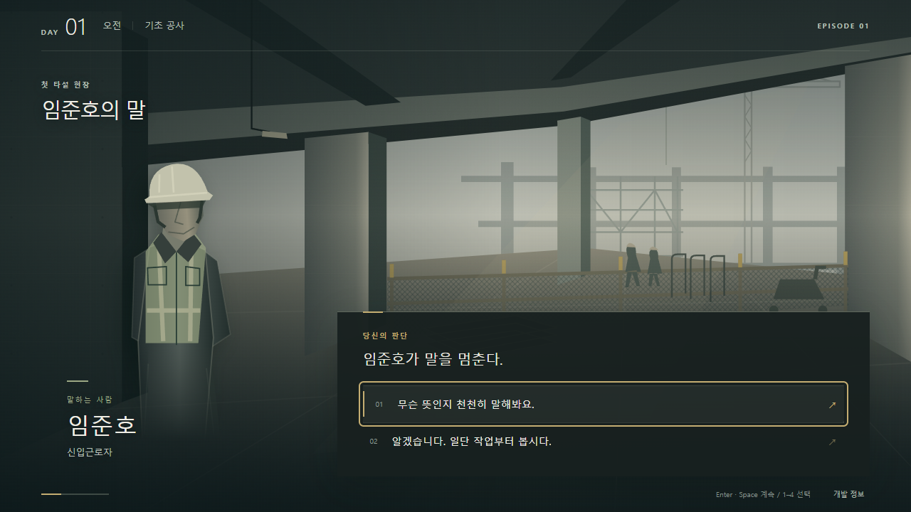

# TASK-006A — Visual Quality & Art Direction

이 문서는 최초 비주얼 패스의 기록이다. 현재 브랜치의 오프닝·인물 소개·장면 맥락·오디오 보강 및 259개 검증 결과는 [TASK-006A-REFINE](TASK-006A-REFINE.md)을 따른다.

## IMPLEMENTED VISUAL SYSTEM

### 방향과 구성

Premium Industrial Minimalism을 목표로 charcoal/steel, 회색 콘크리트, off-white 문자와 제한적인 brass 강조색을 사용한다. 화면 전체를 덮던 인물 카드와 패널을 분리했다. 배경은 공사 현장 내부, 중경은 현재 화자, 전경은 대화·판단, 상단 HUD는 DAY/시간대/Episode 중심이다. 진행은 하단의 가는 선으로 남기고 내부 수치와 조건은 Debug에 유지한다.

대화는 오른쪽 아래에 자연스러운 읽기 폭으로 배치한다. NPC는 왼쪽에 크게 서 있고 이름·역할·현재 화자 표시를 갖는다. 선택은 번호가 붙은 얇은 행이며 숨겨진 결과를 노출하지 않는다. hover/focus에는 왼쪽 선과 밝기 변화, 누르는 동안에는 `:active` 강조가 적용된다. 확정 즉시 기존 Session 명령으로 다음 presentation이 표시된다. 선택 확정을 지연하거나 별도 선택 저장소를 만들지 않았다.

관계 피드백은 화자의 이름이 아니라 실제 영향을 받은 NPC의 이름·변경량을 표시한다. `data-npc-id`로 연결하며 narration으로 넘어간 경우에도 대상을 유지한다. 피드백은 기존처럼 다음 명령에서 교체/해제된다. 대화와 분리된 작은 줄에 표시하고 전체 관계값은 노출하지 않는다.

### 환경과 인물

`IndustrialScene`은 직접 작성한 SVG 구조물이다. 슬래브 하부·기둥·거푸집 흔적, 깊이에 따른 바닥선, 가설 난간·안전망, 철근·적재물·장비·가설 조명, 먼 작업자와 크레인이 공간감을 만든다. 고정 seed의 약한 texture, 방향광과 가장자리 음영을 사용한다. 장면의 작업자는 크기감을 위한 익명 배경 형상이며 NPC 콘텐츠를 추가하지 않는다. 외부 아트나 런타임 네트워크 자산을 사용하지 않는다.

`WorkerSilhouette`의 여섯 art-only variant를 `visuals.json`의 기존 ID에 매핑했다. 플레이어는 직립형, 강태식은 넓은 체형과 팔을 모은 자세, 윤성호는 비대칭 자세, 이재훈은 긴 작업복·클립보드, 임준호는 좁은 체형·앞에 모은 팔, 최민석은 장비 벨트·무전기 형태로 구분한다. 이는 임시 의상·자세 연구이며 인물의 성격·능력치·설정을 새로 정의하지 않는다. 현재 화자만 전면에 표시하고 배경 형상은 낮은 대비를 유지한다.

SVG gradient/pattern/filter ID는 React `useId`로 분리해 여러 슬롯을 렌더링해도 충돌하지 않는다. 배경과 장식 SVG는 접근성 트리에서 제외하며 NPC의 실제 이름과 역할은 텍스트로 제공한다.

### 토큰과 반응형

`playable.css`에 surface/text/accent, 제목·Episode·NPC 이름·역할·대화·응답·피드백·HUD·Debug 글자 크기, spacing, sharp radius, shadow, transition 토큰을 정의했다. 한국어는 로컬 Malgun Gothic/system font를 사용하고 keep-all 및 긴 문자열 줄바꿈을 적용한다. 외부 폰트 의존성은 없다.

- 1280×720 / 1920×1080: 16:9 구도, 큰 화자와 오른쪽 아래 세로 선택 목록. 환경이 상단과 중앙에 드러난다.
- 854×393: 보조 HUD를 생략하고 3개 이상 선택을 두 열로 배치한다. 클릭 높이는 최소 48px이며 두 응답은 세로 목록을 유지한다.
- 더 좁은 화면: 대화 위 화자 공간과 단일 열 선택, 필요 시 스크롤을 허용한다.
- 포커스 외곽선, native disabled 동작, 키보드 입력을 유지했다. reduced-motion에서는 등장 animation과 transition을 제거한다.
- Debug는 별도 불투명 패널과 배경 dim으로 분리하고 기존 개발 전용 lazy 경계를 유지한다.

### 실제 플레이 기준 화면

Episode 01에서 시작 → 첫 대화 → 계획 선택의 임준호 따라가기 → 계속 진행 시 아래 응답 장면에 도달한다. 분리된 mockup이나 개발 전용 경로가 아니다. 직전 임준호 대화에서 보고 +8 피드백을 확인할 수 있다.

[1920×1080](visual/task-006a/reference-1920.png) · [854×393 / 키보드 포커스](visual/task-006a/reference-854.png) · [관계 피드백](visual/task-006a/relationship-feedback.png)

### 변경 파일과 검증

- `src/ui/IndustrialScene.tsx`, `WorkerSilhouette.tsx`: 재사용 가능한 장식 벡터.
- `src/ui/VisualSlot.tsx`, `PlayableEpisode.tsx`, `PresentationView.tsx`, `playable.css`: 인물·배경 슬롯, 화자/피드백 연결, 선택 상태, 레이아웃·타이포그래피.
- `content/episode01/visuals.json`, `content/localization/playable-ko.json`: art-only 매핑과 화자 라벨.
- `tests/visual-quality.test.tsx`: 인물별 다른 형상 및 SVG ID 충돌 방지, 실제 화자 의미 구조, 장면 전환 후 피드백 대상 보존의 3개 회귀 테스트.
- README, 본 문서와 `docs/visual/task-006a/`의 실제 브라우저 캡처.

기존 domain/engine, 관계·대화 Runtime, EpisodeSession, persistence와 Episode 게임 규칙·대사·결과는 변경하지 않았다. 기존 248개 테스트 파일도 수정하지 않았다.

검증 결과: `npm test` **251개 PASS (13개 파일)**, `npm run typecheck` PASS, `npm run build` PASS. 실제 dev 브라우저에서 세 목표 해상도, 2/3/4개 선택, 키보드 포커스, 양수/음수 관계 피드백, Debug 열기/닫기, Episode 완료까지 확인했다. 854×393 응답 버튼은 48px이고 스크롤/잘림이 없었다. 후반 8개 진행 화면의 대화/선택/하단 영역도 화면 안에 있었으며 페이지·콘솔 오류는 없었다.

## FINAL ART ASSETS STILL REQUIRED

현재 구조물과 인물은 의도적으로 제작한 벡터 플레이스홀더이며 최종 원화가 아니다. 최종 환경 일러스트, 인물별 확정 외형·초상/전신 원화, CG와 최종 재질 작업은 여전히 필요하다. 본 작업은 비주얼 방향과 재사용 UI 기준을 제안하며 Director 아트 승인을 대신하지 않는다.

실제 아트는 `visuals.json`의 background/character URI 또는 기존 asset portrait 참조로 교체한다. 배경은 16:9 cover, 인물은 투명 배경의 전신/허벅지 위 구도 contain을 권장한다. 원화가 로드되면 placeholder 위에 표시되며 인물 벡터는 숨겨진다. URI 누락이나 로딩 실패 시 기존 벡터로 복귀하고 이름·역할·대화는 유지된다. 엔진이나 Session을 고칠 필요가 없다.

새 gameplay, Phaser, 추가 DAY/콘텐츠, full save/load, 새 의존성은 추가하지 않았다. main merge 및 다음 TASK는 수행하지 않았다.
