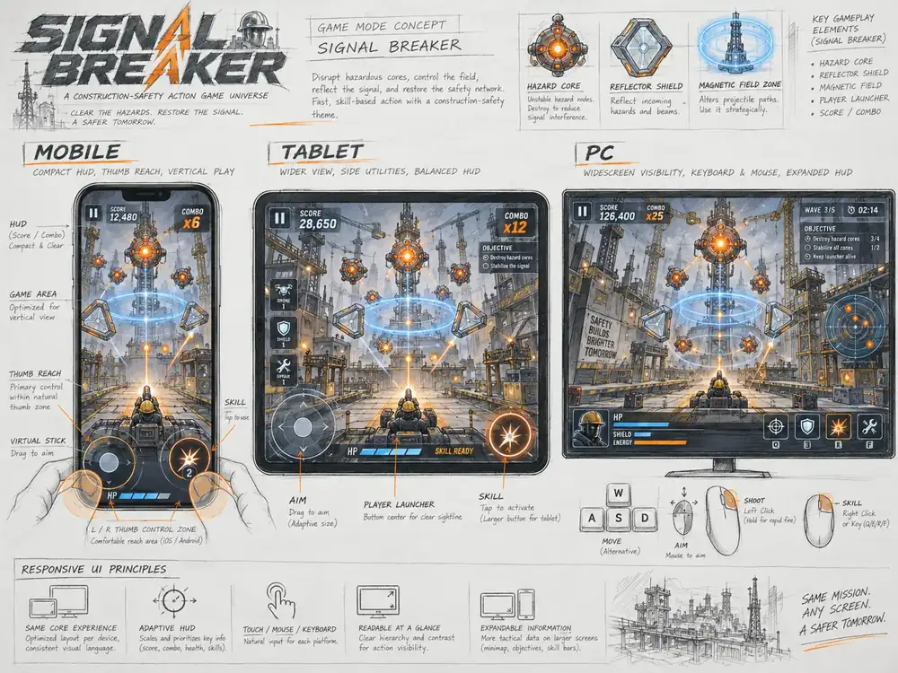
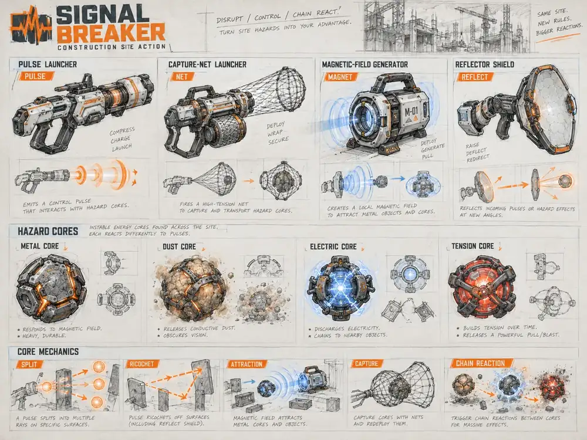
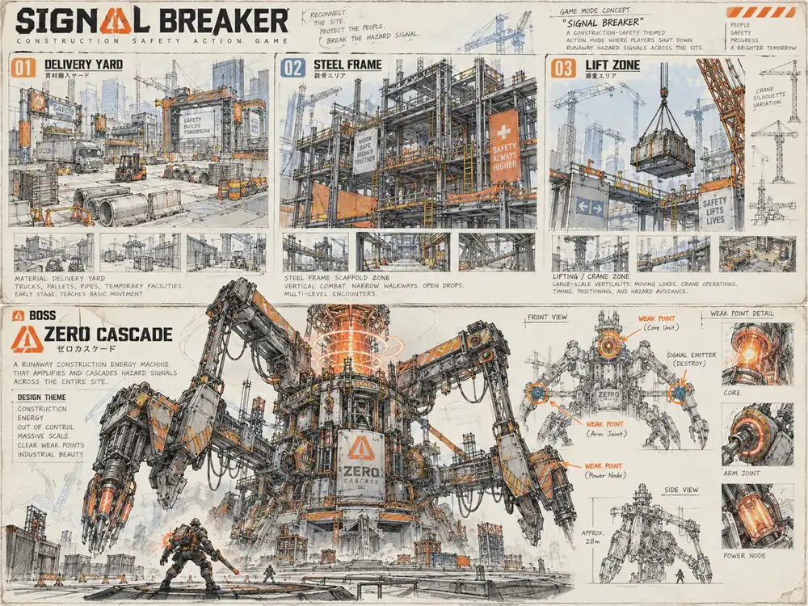

# Original concept sketch ledger · SIGNAL BREAKER

The three images below are preliminary concept sheets, **not** final in-game sprites, UI elements, animation rigs, or licensed photography. They use an original industrial-scifi safety identity with graphite/engineering-drawing texture, orange impact accents and cyan field feedback. All in-game Korean text must be re-authored as real UI text, not baked into generated imagery.

## A. Responsive display architecture

- **Phone:** control hit targets in natural thumb range; keep aiming surface clear; landscape primary, portrait playable with explicit hint.
- **Tablet:** same arena and mechanics with larger touch targets; optional side panel.
- **PC:** mouse precision, keyboard navigation, expanded mission intelligence, extra environmental detail.
- Do not stretch the entire game bitmap to a fixed phone resolution or make phone users aim at offscreen enemies.

## B. Weapon and hazard silhouettes

- Pulse launcher (compress / charge / launch), capture net (deploy / wrap / secure), magnetic field generator (deploy / pull), angular shield (raise / redirect).
- Metal / dust / electric / tension cores need independent silhouettes and distinct responses, not recolors of one circle.
- FX must represent gameplay state: split, reflect, draw, capture, chain; avoid confusing decorative flashes with threats.

## C. Environment and boss silhouettes

- Yard / steel frame / lifting zone should be recognizable at a glance **and** offer different physical interactions.
- ZERO CASCADE's breakable nodes, cable tensions and shield status must be clearly telegraphed at phone width; artist's giant robot is an **art concept**, not a claim it is implemented.
- Preserve clarity when lowering graphics profiles. Collision geometry may not change with particle budget.

## Production asset checklist

Current art status: sketch boards ✓; procedural renderer ✓; authored sprite animation rig ✗; boss turn-around sprites ✗; material-specific impact atlas ✗; full audio mastering ✗; measured frame times on actual hardware ✗. This checklist must be updated only after implementation and QA.